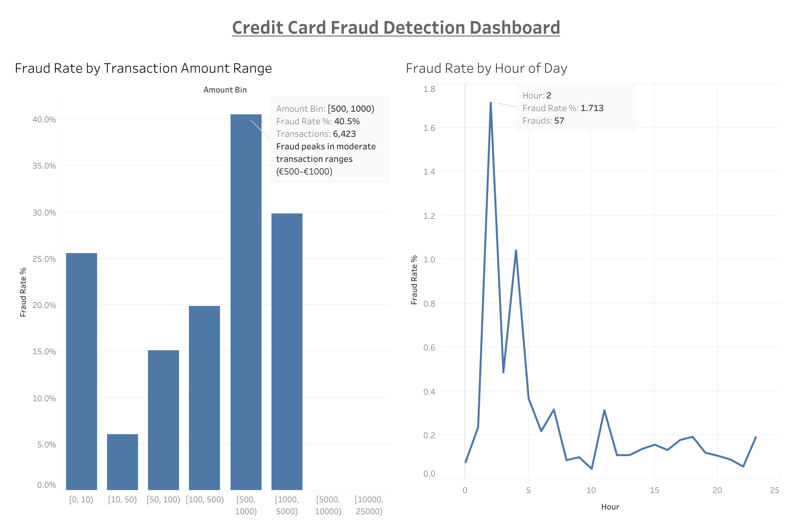

# Credit Card Fraud Detection
_Python • Machine Learning • Tableau_

---

## Overview
An end-to-end fraud detection project analyzing **284,807 credit card transactions** to identify fraudulent behavior patterns.  
This project demonstrates machine learning, model evaluation, and business-focused visualization.

The workflow includes:
- **Data cleaning & exploration** using `pandas` and `matplotlib`
- **Modeling** with Logistic Regression, Random Forest, and XGBoost
- **Balancing class imbalance** using SMOTE
- **Visualization** of fraud patterns in **Tableau**

---

## Key Insights

- **Model Performance:**  
  Random Forest achieved **F1 = 0.85**, while XGBoost achieved **AUC = 0.98**, outperforming logistic regression baselines.

- **Key Predictive Drivers:**  
  Features `V14`, `V4`, `V10`, and `V12` showed the highest importance in both Random Forest and XGBoost models.

- **Precision–Recall Tradeoff:**  
  XGBoost detected **88% of frauds** (high recall) with moderate precision (61%), suitable for risk-averse financial environments.

- **Fraud Distribution:**  
  Only **0.17%** of transactions were fraudulent; applying **SMOTE** balanced the dataset and significantly improved recall.

- **Transaction Value Behavior:**  
  Fraud peaks at **€500–€1000** transactions, suggesting a “sweet spot” for undetected fraudulent spending.

- **Temporal Behavior:**  
  Fraud activity spikes between **1–3 AM**, aligning with periods of low human oversight.

---

## Dashboards

### **Interactive Tableau Dashboard**
[ View on Tableau Public](https://public.tableau.com/app/profile/gautam.ajay/viz/CC_fraud/CreditCardFraudDetectionDashboard?publish=yes)

---

## Technical Stack
**Languages:** Python  
**Libraries:** pandas, scikit-learn, imbalanced-learn, XGBoost, matplotlib  
**Visualization:** Tableau Public  
**Techniques:** Data balancing (SMOTE), Model evaluation (ROC-AUC, F1-score), Feature importance analysis

---

## Repository
📂 [View Code & Notebooks on GitHub](https://github.com/GautamisAjay/GautamisAjay.github.io/tree/main/projects/Fraud_Detection)
