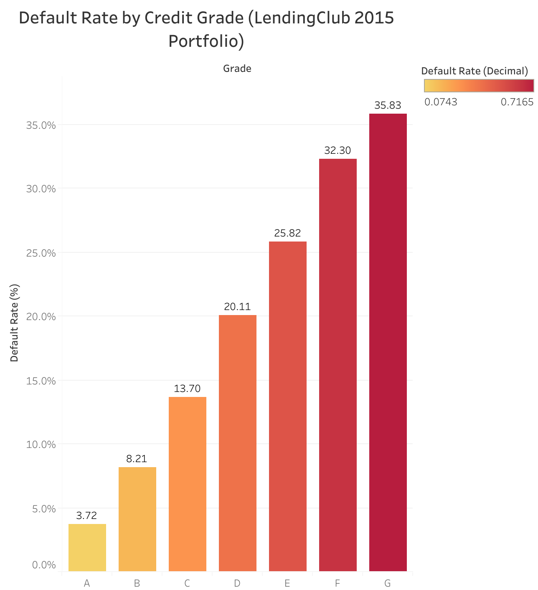
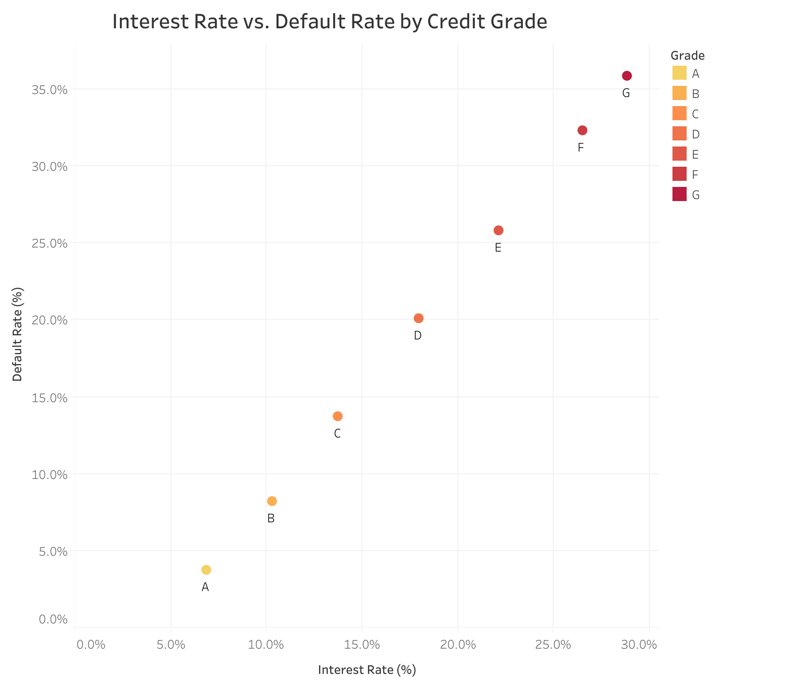

# LendingClub Credit Risk Analysis
_SQL • Python • Tableau_

## Overview
An end-to-end credit risk analysis of **LendingClub’s 2015 loan portfolio**, focused on evaluating risk-based pricing, borrower leverage, and regional risk patterns.

The project demonstrates my ability to perform:
- **SQL analysis** on large lending datasets (500K+ loans)
- **Portfolio-level risk segmentation** by credit grade
- **Interactive Tableau dashboards** with financial KPIs and trends

## Key Insights

- **Credit Risk Gradient:**  
  Default rates rise from **4.7% (Grade A)** to **47.3% (Grade G)**, confirming LendingClub’s internal grade calibration.

- **Risk–Return Relationship:**  
  Interest rates increase from **6.9% to 27.0%**, showing rational pricing through mid-tier grades but diminishing returns in subprime segments.

- **Borrower Leverage and Income:**  
  DTI increases from **16.4% to 21.7%** while average income falls from **$90K to $68K**, indicating reduced repayment capacity at lower credit tiers.

- **Geographic Risk:**  
  Default rates vary regionally, with elevated risk in several midwestern and southern states.

## Dashboards

**Interactive Tableau:**  
[View Dashboard on Tableau Public](https://public.tableau.com/views/LendingClub_CreditRiskDashboard)  

**Static Visuals:**

  
  
  
  

## Data Source
[LendingClub Loan Data (Kaggle)](https://www.kaggle.com/wordsforthewise/lending-club)
