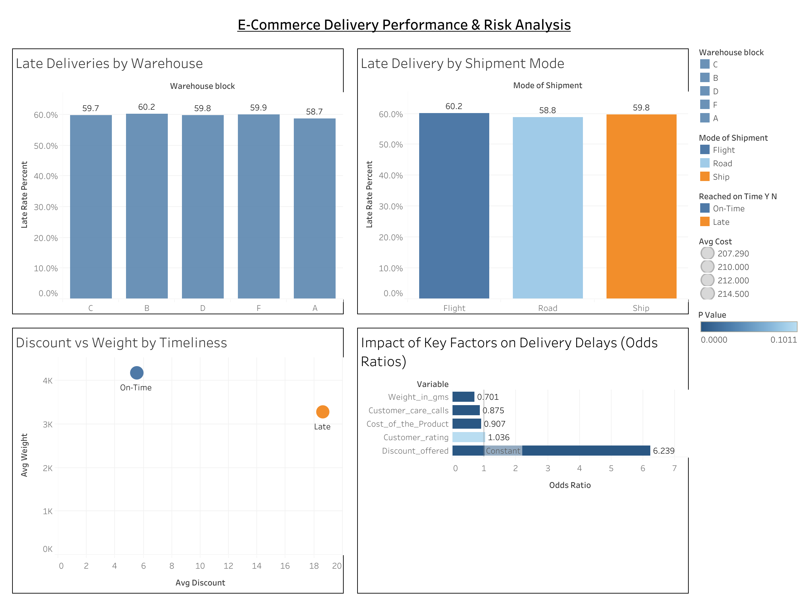

# E-Commerce Delivery Performance & Risk Analysis

Analyzed logistics and delivery performance data for a large e-commerce company to uncover patterns behind late shipments and delivery risk drivers.  
Using Python (pandas, statsmodels) and Tableau, I explored key operational factors influencing delays, including shipment mode, warehouse performance, product weight, and discount levels.

---

## Dashboard

---

## Key Insights

- Approximately 60% of deliveries across all warehouses were late, with very similar rates across locations.  
- Shipment mode had limited influence: flight and ship transport showed slightly higher late rates than road, indicating that internal scheduling or processing delays are likely the main issue.  
- Heavier and higher-cost products were delivered more reliably than lightweight, lower-cost items.  
- Late deliveries were associated with an **average discount of 18.7%**, compared to **5.6%** for on-time orders - a **236% increase**.  
  This likely reflects **compensatory discounts offered after delays**, rather than discounts causing delays. Financially, this suggests that each late shipment may incur additional cost through post-delivery discounts.  
- Customer care calls showed a modest negative relationship with lateness, suggesting that proactive engagement may slightly improve delivery outcomes.

---

## Methods and Tools

- **Python:** pandas, statsmodels (logistic regression, chi-square tests)  
- **Tableau:** dashboard visualization and KPI summaries
- **Data Preparation:** CSV summaries by warehouse, shipment mode, and delivery characteristics  
- **Analysis Focus:** identifying operational patterns and estimating delay risk drivers

---

