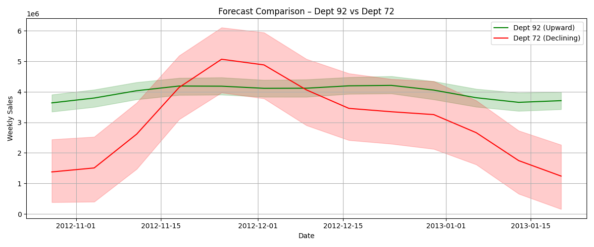
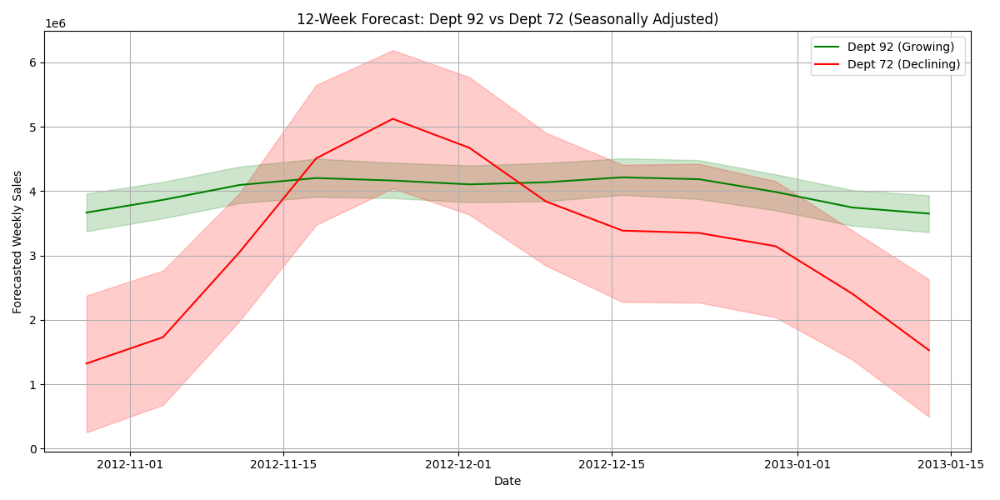
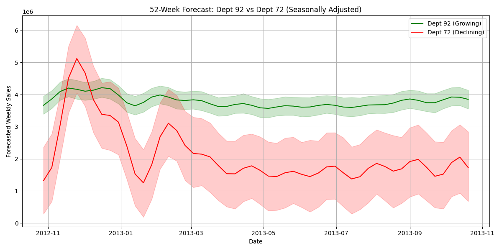
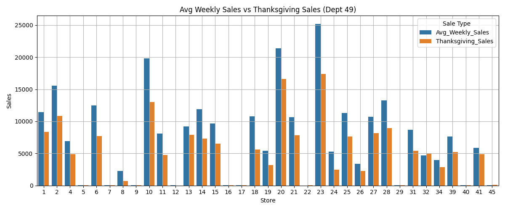

# Walmart Sales Forecasting

**Tools used:** Python, pandas, Prophet, matplotlib

Forecasted weekly sales for Walmart departments across 3 years using time series modeling.

## Key Highlights

- Identified the fastest and slowest growing departments, both of which stayed true after controlling for seasonal effects. 

- Dept 92 is the fastest-growing, with a 52-week forecast totaling $197.4M and a weekly average of $3.8M

- Dept 72 is the steepest decliner by trend slope, despite a temporary 52-week forecast rise to $110M due to seasonal effects

- Quantified Thanksgiving’s impact on Department 49 across all stores, showing an average sales drop of 2,332 dollars (p < 0.001) compared to non-holiday weeks

- Visually compared departments using seasonally adjusted forecasts to highlight strategic performance differences

## Graphs

## 🔗 Project Code

[View on GitHub](https://github.com/GautamisAjay/YOUR-PROJECT-REPO)
